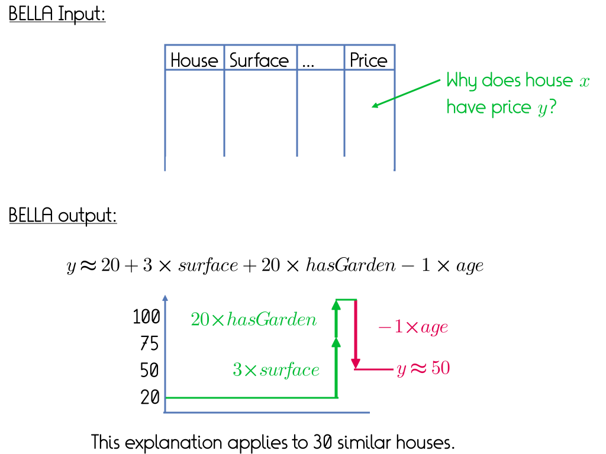

# BELLA


BELLA is a deterministic method to explain a given numerical value in a given tabular dataset -- for example the price of a house in a table that contains houses with their characteristics and prices. The values can also come from a black box regressor, in which case BELLA serves to explain the predictions of that regressor.
<br/><br/>
BELLA computes the optimal neighbourhood around the given data point and then trains a linear regression model on this neighborhood. This model can then be used to explain the value of the data point. Since the model has been trained in the input feature space, one can easily change the feature values in this model to see how this affects the outcome. BELLA tries to maximize the size of the neighborhood, and so its explanations apply not just to the point in question, but also to other points in the vicinity.
<br/><br/>
BELLA can provide both factual and counterfactual explanations, and the explanations are accurate, general, simple, robust, deterministic, and verifiable.

## How to run BELLA
Using the BellaExplainer class

```
import pandas as pd
from bella import BellaExplainer

# Load your dataset (must include the target column)
train = pd.read_csv("your_train.csv")

# Initialize the explainer
explainer = BellaExplainer(
    train=train,
    target_column="target",
    binary_features=["b1", "b2"],
    categorical_features=["cat1", "cat2"],
    numerical_features=["n1", "n2", "n3"],
    standardize=True,
)

# Define the point to explain
point = {
    "b1": 1,
    "b2": 0,
    "cat1": "A",
    "cat2": "X",
    "n1": 0.5,
    "n2": 1.2,
    "n3": -0.7,
    "target": 1,  # optional
}

# Get standard explanation
exp_box, exp_model, exp = explainer.explain(point)

# Or generate counterfactuals with a reference value
c_exp_model, new_data_point, counterfactual = explainer.explain(
    point, reference_value=0.0
)

```

To run the experiments, open the terminal and run:

```python3 run.py```

## Conditions of use

The code is made available under a [MIT License](docs/license.txt) by [Nedeljko Radulovic](https://nedrad88.github.io/), [Albert Bifet](https://albertbifet.com/), and [Fabian M. Suchanek](https://suchanek.name). If you use BELLA for scientific purposes, please cite [our paper](https://suchanek.name/work/publications/tmlr-2025.pdf).

```
@article{radulovic2023bellablackboxmodel,
      title={BELLA: Black box model Explanations by Local Linear Approximations}, 
      author={Nedeljko Radulovic and Albert Bifet and Fabian M. Suchanek},
      year={2025},
      journal={Transactions on Machine Learning Research}
}
```
